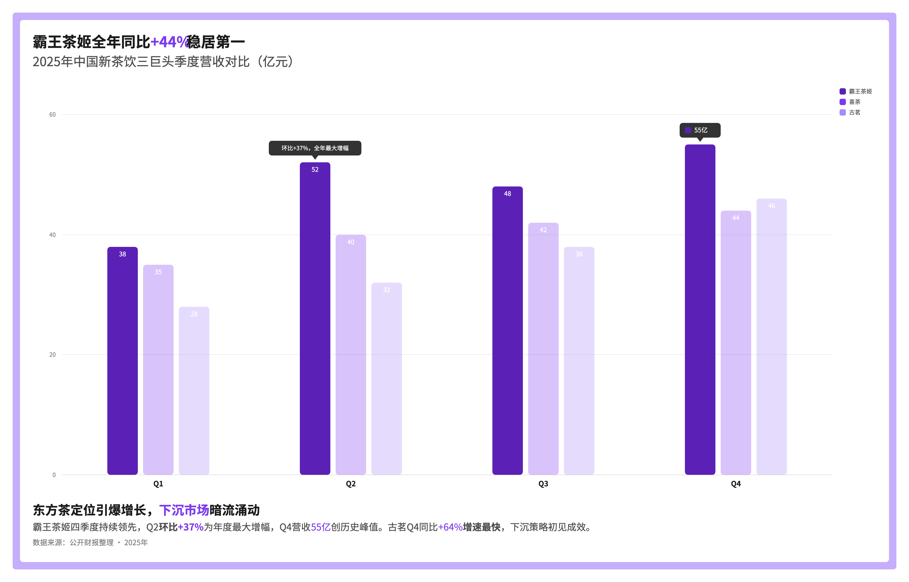
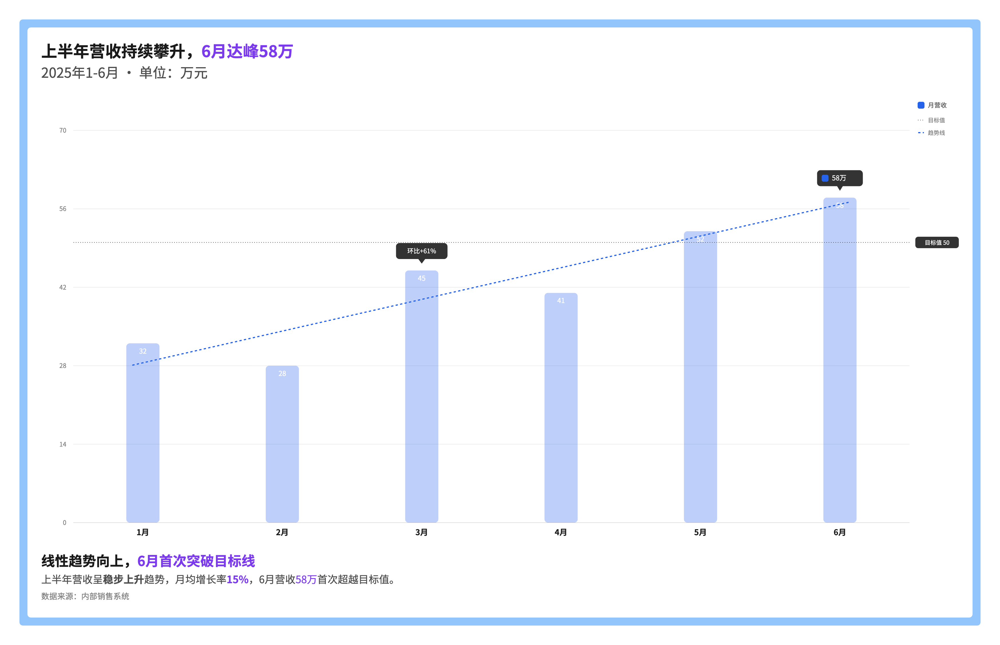
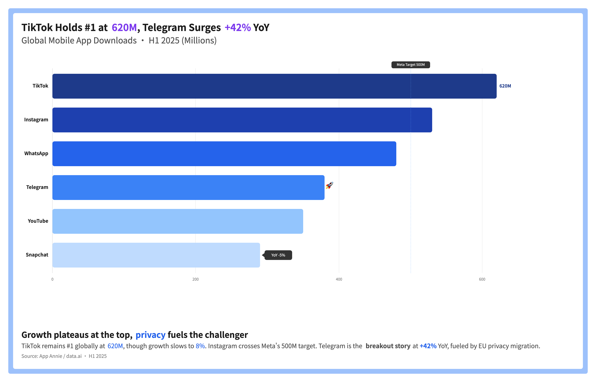
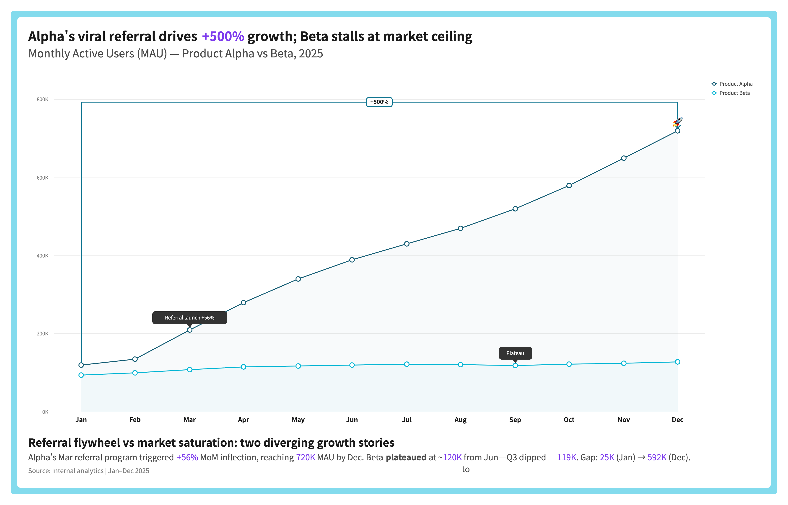
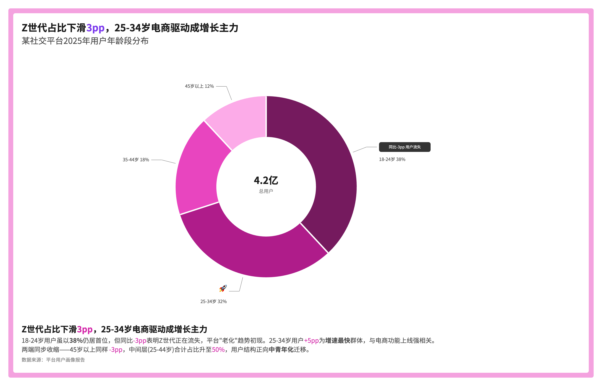
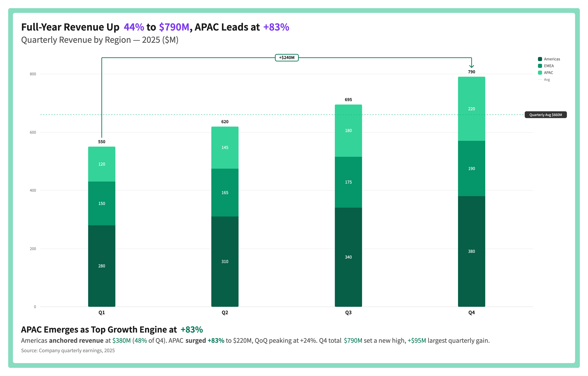
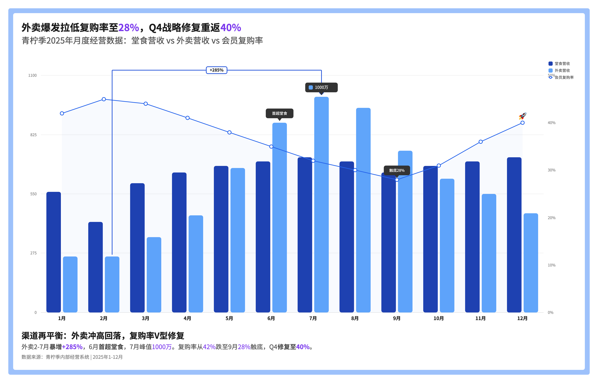
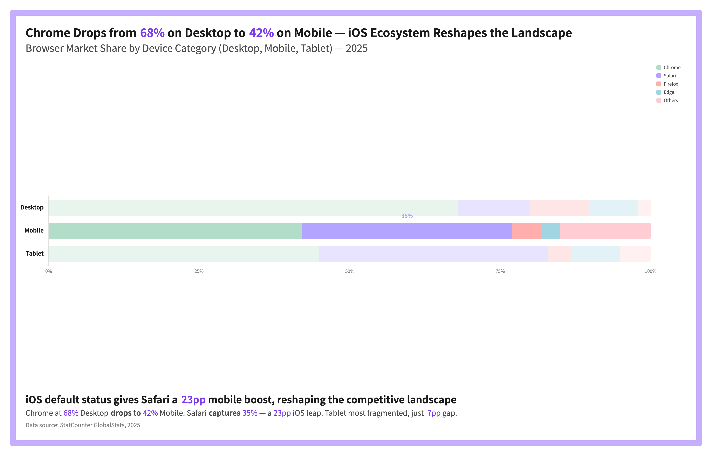
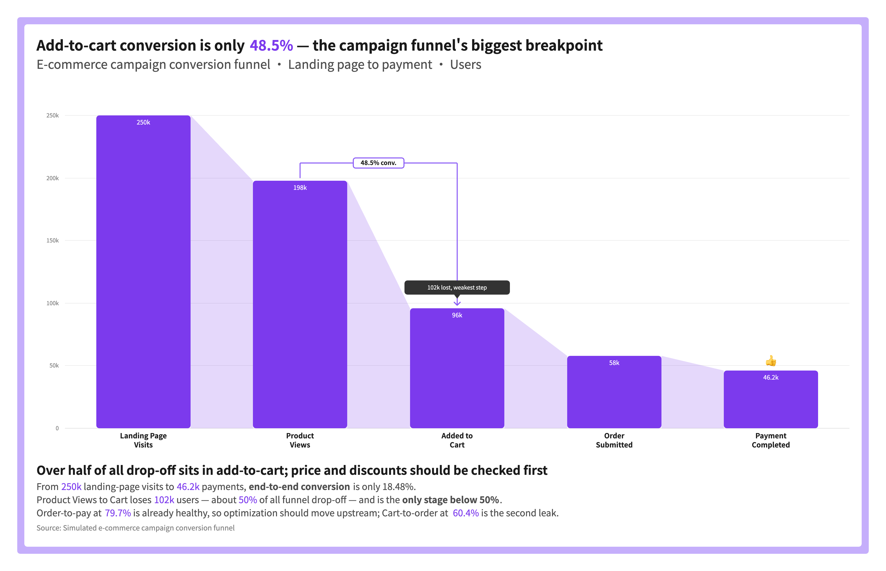

# larkboard-graphy

[](https://docs.anthropic.com)
[](https://cursor.sh)
[](./LICENSE)

> AI 驱动的飞书白板数据叙事 —— 不只是图表，而是叙事。

[English](./README.md)

## 什么是 larkboard-graphy？

**larkboard-graphy** 是一个 AI Agent Skill，能生成完全可编辑的飞书白板数据图表，内置数据叙事能力。它在原始数据与有说服力的视觉叙事之间架起桥梁。

### 设计思想

- **叙事优先** —— 每张图表都是一个故事。Widget（注释、趋势线、高亮）是一等公民，不是事后添加。Skill 在绘制任何元素前就分析数据并提出叙事策略。
- **可编辑，非静态** —— 与截图式图表工具不同，每个元素（形状、文字、连线）都以飞书白板原生对象落地。团队可以在生成后直接移动、缩放、改色、扩展。
- **约束驱动渲染** —— 基于反复验证的飞书 SVG 白板渲染器能力边界（仅原生形状、无渐变、无 foreignObject、有限 opacity 支持）。`RULES.md` 中的每条规则都经过实机验证。
- **三段式架构** —— 每张图表遵循统一布局：标题区（结论先行的标题）、图表区（数据 + Widget）、信息区（洞察叙事 + 来源）。确保每张图表讲述完整故事。

### 与传统图表的差异

| | 传统图表工具 | larkboard-graphy |
|--|-------------|------------------|
| 输出形式 | 静态图片 / iframe | 可编辑的原生白板形状 |
| 数据叙事 | 导出后手动标注 | AI 生成时就内置 Widget |
| 协作 | 只能查看或重新导出 | 团队直接在飞书上编辑 |
| 设计体系 | 通用默认样式 | Graphy 专属字体、间距、色彩系统 |

## 效果预览

| 分组柱状图 | 柱状图 + 趋势线 | 水平条形图 | 多系列折线图 |
|:--:|:--:|:--:|:--:|
|  |  |  |  |

| 环形图 + Widget | 堆叠柱状图 | 柱线组合图 | 百分比堆叠条形图 |
|:--:|:--:|:--:|:--:|
|  |  |  |  |

| 漏斗图 |
|:--:|
|  |

## 支持图表类型

| 类型 | 说明 |
|------|------|
| Column | 垂直柱状图（分组） |
| Column Stacked | 垂直堆叠柱状图（绝对值） |
| Column 100% Stacked | 垂直百分比堆叠柱状图 |
| Bar | 水平条形图 |
| Bar Stacked | 水平堆叠条形图（绝对值） |
| Bar 100% Stacked | 水平百分比堆叠条形图 |
| Line | 折线图 |
| Pie | 饼图（实心圆） |
| Donut | 环形图（可含中心标签） |
| Combo | 柱线组合图 |
| Funnel | 漏斗图（单系列柱 + 连接斜面） |

## Widget 体系

Widget 是数据叙事层 —— 将普通图表转化为带有观点的叙事。

| Widget | 含义 | 使用场景 |
|--------|------|----------|
| **Comment** | 文字注释，解释数据背后的原因 | 标注因果关系、背景信息或定性洞察（如"新政策上线"） |
| **PinNumber** | 精确数值标注，强调关键指标 | 突出特定 KPI 或里程碑数字 |
| **Sticker** | Emoji 情感标记，传达情绪/趋势方向 | 一眼传达趋势感受（🚀 增长、⚠️ 警告） |
| **DifferenceArrow** | 数据对比箭头，量化差距 | 展示两个数据点之间的精确差值（如"+12亿差距"） |
| **AverageLine** | 均值参考线，横跨图表 | 建立对比基准线 |
| **GoalLine** | 目标参考线，标注目标/KPI | 标记业务目标或基准值 |
| **TrendLine** | 线性回归趋势线 | 揭示数据整体走向（当个别点噪声较大时） |
| **Highlight** | 聚焦高亮，非高亮元素弱化至 0.3 | 在复杂图表中聚焦注意力到特定柱子/分组/系列/折线 |
| **HighlightLabel** | 选择性数值标注 | Data Label 关闭时，仅在关键数据点显示数值 |

## 主题色盘

### Monochrome 单色渐变（9 套，每套 8 色）

<!-- 色值来源：graphy/src/components/AsideSetting/Design/PresetSection/config.ts -->

**blue**<br>


**cyan**<br>


**green**<br>


**yellow**<br>


**orange**<br>


**red**<br>


**pink**<br>


**purple**<br>


**grey**<br>


### Colorful 多彩系列

**Pastel（柔和）**<br>


**Vivid（鲜艳）**<br>


## 工作原理

```
┌─────────────────────────────────────────────────────────────────┐
│  1. 数据输入                                                     │
│     用户提供数据（表格 / JSON / 文本描述）                          │
│                          ↓                                      │
│  2. 图表类型选择                                                  │
│     Agent 根据数据特征推荐图表类型                                  │
│                          ↓                                      │
│  3. 主题色盘选择                                                  │
│     用户选择 Monochrome 或 Colorful 色盘                          │
│                          ↓                                      │
│  4. 叙事分析                                                     │
│     Agent 识别关键洞察，提出 Widget 方案                            │
│    （标注哪些数据点、高亮哪些区域、对比什么）                         │
│                          ↓                                      │
│  5. SVG 生成                                                     │
│     按飞书白板渲染规则构建完整 SVG                                  │
│    （仅原生形状，无渐变，无 foreignObject）                         │
│                          ↓                                      │
│  6. 校验                                                         │
│     whiteboard-cli --check 验证文字溢出、节点重叠                   │
│     检测到错误时自动修复（最多 3 轮）                                │
│                          ↓                                      │
│  7. 发布到飞书                                                    │
│     lark-cli 创建文档 → 写入 SVG 白板内容                          │
│     返回可分享的飞书文档链接                                        │
└─────────────────────────────────────────────────────────────────┘
```

生成的白板在飞书中**完全可编辑** —— 每个形状、文字、连线都可以手动移动、缩放或改色。

## 前置依赖

- **Node.js** >= 18
- **飞书 / Lark 账号** — 白板写入你自己的租户
- **`lark-cli`**（`@larksuite/cli`），已安装并认证：
  ```bash
  npm install -g @larksuite/cli
  lark-cli auth login --as user
  ```
- **`@larksuite/whiteboard-cli`** — 通过 npx 使用，自动下载无需安装

## 安装

**告诉你的 Agent**（Cursor、Claude Code 等）：

> "安装 **larkboard-graphy** skill，来自 `github.com/user/larkboard-graphy`。"

或手动安装（克隆到 Agent 的 skills 目录）：

```bash
# Cursor skills 目录
git clone https://github.com/user/larkboard-graphy \
  ~/.cursor/skills/larkboard-graphy

# 或 Claude Code skills 目录
git clone https://github.com/user/larkboard-graphy \
  ~/.claude/skills/larkboard-graphy
```

然后运行环境检查：

```bash
bash scripts/preflight.sh
```

## 快速开始

在 Cursor 中使用以下触发词唤起 Skill：

- `"生成飞书图表白板"`
- `"larkboard graphy"`
- `"数据图表白板"`
- `"graphy 白板"`
- `"飞书数据故事"`

交互流程：

1. **提供数据** — 粘贴表格、JSON 或用自然语言描述数据
2. **确认图表类型** — Agent 根据数据特征推荐
3. **选择主题** — 从 Monochrome 或 Colorful 色盘中选择
4. **审核叙事方案** — Agent 提出 Widget 策略及理由
5. **获取链接** — 返回完全可编辑的飞书白板 URL

### 使用示例

```
/larkboard-graphy 背景：2025年新能源车三巨头（比亚迪、理想、小米）季度营收对比，比亚迪全年领跑Q4达1280亿创新高，理想稳步增长，小米Q2入局后快速爬坡。数据：
季度	比亚迪(亿元)	理想(亿元)	小米(亿元)
Q1	980	450	0
Q2	1100	520	180
Q3	1180	580	350
Q4	1280	620	520
```

## Roadmap

- [ ] 瀑布图（Waterfall）支持
- [ ] 散点图 / 气泡图
- [ ] 水平时间轴图

## 协议

[MIT](./LICENSE)
